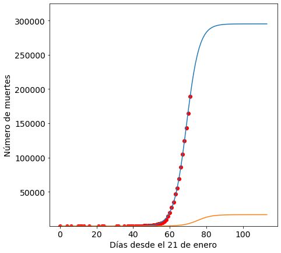

## ¿Cuándo alcanzará Argentina el pico de contagios por covid19?

Este es un script de python para modelizar la curva de contagios de covid19 en Argentina. 


```python
import pandas as pd
import numpy as np
from datetime import datetime,timedelta
import time
from sklearn.metrics import mean_squared_error
from scipy.optimize import curve_fit
from scipy.optimize import fsolve
import matplotlib.pyplot as plt
%matplotlib inline
import warnings
warnings.filterwarnings('ignore')
```

Lo primero que hacemos es leer los datos desde la url donde se depositan los casos diarios de covid19


```python

url = "https://www.ecdc.europa.eu/sites/default/files/documents/COVID-19-geographic-disbtribution-worldwide.xlsx"
df = pd.read_excel(url)
```


```python
# esto es para chequear la tabla de datos 
for col in df.columns: 
    print(col) 
```

    dateRep
    day
    month
    year
    cases
    deaths
    countriesAndTerritories
    geoId
    countryterritoryCode
    popData2018


```python
Arg=df[df.countriesAndTerritories=='Argentina']
```


```python
Arg.head()
```


<div>
<style scoped>
    .dataframe tbody tr th:only-of-type {
        vertical-align: middle;
    }

    .dataframe tbody tr th {
        vertical-align: top;
    }

    .dataframe thead th {
        text-align: right;
    }
</style>
<table border="1" class="dataframe">
  <thead>
    <tr style="text-align: right;">
      <th></th>
      <th>dateRep</th>
      <th>day</th>
      <th>month</th>
      <th>year</th>
      <th>cases</th>
      <th>deaths</th>
      <th>countriesAndTerritories</th>
      <th>geoId</th>
      <th>countryterritoryCode</th>
      <th>popData2018</th>
    </tr>
  </thead>
  <tbody>
    <tr>
      <td>244</td>
      <td>2020-04-01</td>
      <td>1</td>
      <td>4</td>
      <td>2020</td>
      <td>0</td>
      <td>0</td>
      <td>Argentina</td>
      <td>AR</td>
      <td>ARG</td>
      <td>44494502.0</td>
    </tr>
    <tr>
      <td>245</td>
      <td>2020-03-31</td>
      <td>31</td>
      <td>3</td>
      <td>2020</td>
      <td>146</td>
      <td>4</td>
      <td>Argentina</td>
      <td>AR</td>
      <td>ARG</td>
      <td>44494502.0</td>
    </tr>
    <tr>
      <td>246</td>
      <td>2020-03-30</td>
      <td>30</td>
      <td>3</td>
      <td>2020</td>
      <td>75</td>
      <td>1</td>
      <td>Argentina</td>
      <td>AR</td>
      <td>ARG</td>
      <td>44494502.0</td>
    </tr>
    <tr>
      <td>247</td>
      <td>2020-03-29</td>
      <td>29</td>
      <td>3</td>
      <td>2020</td>
      <td>55</td>
      <td>2</td>
      <td>Argentina</td>
      <td>AR</td>
      <td>ARG</td>
      <td>44494502.0</td>
    </tr>
    <tr>
      <td>248</td>
      <td>2020-03-28</td>
      <td>28</td>
      <td>3</td>
      <td>2020</td>
      <td>101</td>
      <td>5</td>
      <td>Argentina</td>
      <td>AR</td>
      <td>ARG</td>
      <td>44494502.0</td>
    </tr>
  </tbody>
</table>
</div>


```python
#agregamos el dato del día de hoy
Arg[:1]['cases']=88
```


```python
Arg[:1]['deaths']=4
```

## Preparemos los datos


```python
df1 = Arg.loc[:,['dateRep','cases','deaths']]
#quitamos el dia de hoy que no tiene datos
#df1=df1.drop(df1.index[0])
Format = '%Y-%m-%d %H:%M:%S'
date = pd.to_datetime(df1["dateRep"])
date=date.to_list()
```


```python
type(df1)
```


    pandas.core.frame.DataFrame


```python
dates=np.array([])
for i in date:
    t=(datetime.strptime(str(i),Format) - datetime.strptime("2020-03-04 00:00:00",Format)).days
    dates = np.append(dates, t)
```


```python
dates
```


    array([28., 27., 26., 25., 24., 23., 22., 21., 20., 19., 18., 17., 16.,
           15., 14., 13., 12., 11., 10.,  9.,  7.,  5.,  4.,  3.,  2.,  0.])


```python
df1['dateRep']=dates
```


```python
df1.head()
```


<div>
<style scoped>
    .dataframe tbody tr th:only-of-type {
        vertical-align: middle;
    }

    .dataframe tbody tr th {
        vertical-align: top;
    }

    .dataframe thead th {
        text-align: right;
    }
</style>
<table border="1" class="dataframe">
  <thead>
    <tr style="text-align: right;">
      <th></th>
      <th>dateRep</th>
      <th>cases</th>
      <th>deaths</th>
    </tr>
  </thead>
  <tbody>
    <tr>
      <td>244</td>
      <td>28.0</td>
      <td>88</td>
      <td>4</td>
    </tr>
    <tr>
      <td>245</td>
      <td>27.0</td>
      <td>146</td>
      <td>4</td>
    </tr>
    <tr>
      <td>246</td>
      <td>26.0</td>
      <td>75</td>
      <td>1</td>
    </tr>
    <tr>
      <td>247</td>
      <td>25.0</td>
      <td>55</td>
      <td>2</td>
    </tr>
    <tr>
      <td>248</td>
      <td>24.0</td>
      <td>101</td>
      <td>5</td>
    </tr>
  </tbody>
</table>
</div>


## Ahora estamos listos para el modelo logístico 

La función logística es 

 $f(x,a,b,c)=\frac{c}{1+e^{\frac{-(x-b)}{a}}}$ 

Dónde $a$ es la velocidad de la infección, $b$ es el día con máximo número de infectados y $c$ es el número total de infectados al final de la epidemia, mientras que x es el tiempo desde el comienzo de la epidemia. 


```python
def logistic_model(x,a,b,c):
    return c/(1+np.exp(-(x-b)/a))
```


```python
type(list(df1.iloc[:,1]))
```


    list


```python
x=list(df1['dateRep'])
y=list(df1['cases'])
yd=list(df1['deaths'])
```


```python
x=np.flip(x)
y=np.flip(y)
yd=np.flip(yd)
```


```python
cum=y
cumd=yd
for i in range(1,len(y)):
    cum[i]=cum[i-1]+y[i]
    cumd[i]=cumd[i-1]+yd[i]
```


```python
fit = curve_fit(logistic_model,list(x),list(cum),p0=[1,50,3000000])
fitd = curve_fit(logistic_model,list(x),list(cumd),p0=[1,50,3000000])
```


```python
a=fit[0][0]
b=fit[0][1]
c=fit[0][2]
c
```


    1509.3329481584017


```python
ad=fitd[0][0]
bd=fitd[0][1]
cd=fitd[0][2]
cd
```


    56.378627453465


```python
c+fit[1][2][2]
```


    7475.757701526373


```python
#10000 infectados máximo, pero claro entre los reportados 

```


```python
sol = int(fsolve(lambda x : logistic_model(x,a,b,c) - int(c),b))

```


```python
end=(datetime.strptime("2020-03-04 00:00:00",Format) + timedelta(days=66))
end
```


    datetime.datetime(2020, 5, 9, 0, 0)


```python
#final de la infeccion el 9 de mayo! parece imposible
```


```python
x=x.astype(int)
x=list(x)
```


```python
max(x)
```


    28


```python
pred_x = list(range(max(x),sol))
plt.rcParams['figure.figsize'] = [7, 7]
plt.rc('font', size=14)
# Real data
plt.scatter(x,cum[0:],label="Real data",color="red")
# Predicted logistic curve
plt.plot(list(x)+pred_x, [logistic_model(i,fit[0][0],fit[0][1],fit[0][2]) for i in list(x)+pred_x], label="Logistic model" )
plt.xlabel("Días desde el 4 de marzo")
plt.ylabel("Número de infectados")
plt.ylim((min(cum)*0.9,c*1.1))
plt.plot(list(x)+pred_x, [logistic_model(i,fitd[0][0],fitd[0][1],fitd[0][2]) for i in list(x)+pred_x], label="Logistic model" )
plt.xlabel("Días desde el 4 de marzo")
plt.ylabel("Número de muertes")
plt.ylim((min(cum)*0.9,c*1.1))
plt.show()
```





La curva naranja es la curva de la evolución de muertes y la azul es la curva de evolución de casos. 


```python
[logistic_model(i,fit[0][0],fit[0][1],fit[0][2]) for i in list([27,28,29,30,31])]
```


    [955.0480968994318,
     1043.2194900211632,
     1123.0382926387022,
     1193.3289968825816,
     1253.7404309869519]


```python
[logistic_model(i,fitd[0][0],fitd[0][1],fitd[0][2]) for i in list([27,28,29,30,31])]
```


    [24.41484672696802,
     28.121861709180674,
     31.83121111951552,
     35.41658638740742,
     38.76800899829]


En los próximos días se esperan tener 1200 infectados y cerca de 40 muertos. Hay dos cosas para remarcar
1. El confinamiento está mostrando un efecto porque el número de infectados crece lentamente 
2. Los números que se informan están muy sesgados (no podemos saber cuánto)
3. El dengue también es epidemia hoy en Argentina. Epidemia de la que no se habla. 


```python

```
