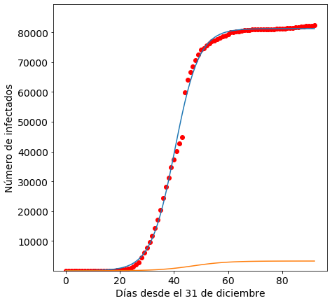

## Modelando el covid19 en China

Este es un script de python para modelizar la curva de contagios de covid19 en China. 


```python
import pandas as pd
import numpy as np
from datetime import datetime,timedelta
import time
from sklearn.metrics import mean_squared_error
from scipy.optimize import curve_fit
from scipy.optimize import fsolve
import matplotlib.pyplot as plt
%matplotlib inline
```


```python
url = "https://www.ecdc.europa.eu/sites/default/files/documents/COVID-19-geographic-disbtribution-worldwide.xlsx"
df = pd.read_excel(url)
```


```python
for col in df.columns: 
    print(col) 
```

    dateRep
    day
    month
    year
    cases
    deaths
    countriesAndTerritories
    geoId
    countryterritoryCode
    popData2018


```python
df['countriesAndTerritories']=='China'
```


    0       False
    1       False
    2       False
    3       False
    4       False
            ...  
    8097    False
    8098    False
    8099    False
    8100    False
    8101    False
    Name: countriesAndTerritories, Length: 8102, dtype: bool


```python
China=df[df.countriesAndTerritories=='China']
```


```python
China
```


<div>
<style scoped>
    .dataframe tbody tr th:only-of-type {
        vertical-align: middle;
    }

    .dataframe tbody tr th {
        vertical-align: top;
    }

    .dataframe thead th {
        text-align: right;
    }
</style>
<table border="1" class="dataframe">
  <thead>
    <tr style="text-align: right;">
      <th></th>
      <th>dateRep</th>
      <th>day</th>
      <th>month</th>
      <th>year</th>
      <th>cases</th>
      <th>deaths</th>
      <th>countriesAndTerritories</th>
      <th>geoId</th>
      <th>countryterritoryCode</th>
      <th>popData2018</th>
    </tr>
  </thead>
  <tbody>
    <tr>
      <td>1558</td>
      <td>2020-04-01</td>
      <td>1</td>
      <td>4</td>
      <td>2020</td>
      <td>54</td>
      <td>1</td>
      <td>China</td>
      <td>CN</td>
      <td>CHN</td>
      <td>1.392730e+09</td>
    </tr>
    <tr>
      <td>1559</td>
      <td>2020-03-31</td>
      <td>31</td>
      <td>3</td>
      <td>2020</td>
      <td>84</td>
      <td>3</td>
      <td>China</td>
      <td>CN</td>
      <td>CHN</td>
      <td>1.392730e+09</td>
    </tr>
    <tr>
      <td>1560</td>
      <td>2020-03-30</td>
      <td>30</td>
      <td>3</td>
      <td>2020</td>
      <td>98</td>
      <td>2</td>
      <td>China</td>
      <td>CN</td>
      <td>CHN</td>
      <td>1.392730e+09</td>
    </tr>
    <tr>
      <td>1561</td>
      <td>2020-03-29</td>
      <td>29</td>
      <td>3</td>
      <td>2020</td>
      <td>113</td>
      <td>5</td>
      <td>China</td>
      <td>CN</td>
      <td>CHN</td>
      <td>1.392730e+09</td>
    </tr>
    <tr>
      <td>1562</td>
      <td>2020-03-28</td>
      <td>28</td>
      <td>3</td>
      <td>2020</td>
      <td>119</td>
      <td>3</td>
      <td>China</td>
      <td>CN</td>
      <td>CHN</td>
      <td>1.392730e+09</td>
    </tr>
    <tr>
      <td>...</td>
      <td>...</td>
      <td>...</td>
      <td>...</td>
      <td>...</td>
      <td>...</td>
      <td>...</td>
      <td>...</td>
      <td>...</td>
      <td>...</td>
      <td>...</td>
    </tr>
    <tr>
      <td>1646</td>
      <td>2020-01-04</td>
      <td>4</td>
      <td>1</td>
      <td>2020</td>
      <td>0</td>
      <td>0</td>
      <td>China</td>
      <td>CN</td>
      <td>CHN</td>
      <td>1.392730e+09</td>
    </tr>
    <tr>
      <td>1647</td>
      <td>2020-01-03</td>
      <td>3</td>
      <td>1</td>
      <td>2020</td>
      <td>17</td>
      <td>0</td>
      <td>China</td>
      <td>CN</td>
      <td>CHN</td>
      <td>1.392730e+09</td>
    </tr>
    <tr>
      <td>1648</td>
      <td>2020-01-02</td>
      <td>2</td>
      <td>1</td>
      <td>2020</td>
      <td>0</td>
      <td>0</td>
      <td>China</td>
      <td>CN</td>
      <td>CHN</td>
      <td>1.392730e+09</td>
    </tr>
    <tr>
      <td>1649</td>
      <td>2020-01-01</td>
      <td>1</td>
      <td>1</td>
      <td>2020</td>
      <td>0</td>
      <td>0</td>
      <td>China</td>
      <td>CN</td>
      <td>CHN</td>
      <td>1.392730e+09</td>
    </tr>
    <tr>
      <td>1650</td>
      <td>2019-12-31</td>
      <td>31</td>
      <td>12</td>
      <td>2019</td>
      <td>27</td>
      <td>0</td>
      <td>China</td>
      <td>CN</td>
      <td>CHN</td>
      <td>1.392730e+09</td>
    </tr>
  </tbody>
</table>
<p>93 rows × 10 columns</p>
</div>


## Preparemos los datos


```python
df1 = China.loc[:,['dateRep','cases','deaths']]
#quitamos el dia de hoy que no tiene datos
#df1=df1.drop(df1.index[0])
Format = '%Y-%m-%d %H:%M:%S'
date = pd.to_datetime(df1["dateRep"])
date=date.to_list()
```


```python
type(df1)
```


    pandas.core.frame.DataFrame


```python
dates=np.array([])
for i in date:
    t=(datetime.strptime(str(i),Format) - datetime.strptime("2019-12-31 00:00:00",Format)).days
    dates = np.append(dates, t)
```


```python
df1['dateRep']=dates
```


```python
dates
```


    array([92., 91., 90., 89., 88., 87., 86., 85., 84., 83., 82., 81., 80.,
           79., 78., 77., 76., 75., 74., 73., 72., 71., 70., 69., 68., 67.,
           66., 65., 64., 63., 62., 61., 60., 59., 58., 57., 56., 55., 54.,
           53., 52., 51., 50., 49., 48., 47., 46., 45., 44., 43., 42., 41.,
           40., 39., 38., 37., 36., 35., 34., 33., 32., 31., 30., 29., 28.,
           27., 26., 25., 24., 23., 22., 21., 20., 19., 18., 17., 16., 15.,
           14., 13., 12., 11., 10.,  9.,  8.,  7.,  6.,  5.,  4.,  3.,  2.,
            1.,  0.])


## Ahora estamos listos para el modelo logístico 

La función logística es 

 $f(x,a,b,c)=\frac{c}{1+e^{\frac{-(x-b)}{a}}}$ 

Dónde $a$ es la velocidad de la infección, $b$ es el día con máximo número de infectados y $c$ es el número total de infectados al final de la epidemia.


```python
def logistic_model(x,a,b,c):
    return c/(1+np.exp(-(x-b)/a))
```


```python
type(list(df1.iloc[:,1]))
```


    list


```python
x=list(df1['dateRep'])
y=list(df1['cases'])
yd=list(df1['deaths'])
```


```python
x=np.flip(x)
y=np.flip(y)
yd=np.flip(yd)
```


```python
cum=y
cumd=yd
for i in range(1,len(y)):
    cum[i]=cum[i-1]+y[i]
    cumd[i]=cumd[i-1]+yd[i]
```


```python
fit = curve_fit(logistic_model,list(x),list(cum),p0=[2,20,1300000000])
```


```python
fitd = curve_fit(logistic_model,list(x),list(cumd),p0=[2,20,1300000000])
```


```python
a=fit[0][0]
b=fit[0][1]
c=fit[0][2]
```


```python
c+fit[1][2][2]
#140911 infectados maximos
```


    140911.03215285006


```python
b
```


    40.33298365609606


```python
ad=fitd[0][0]
bd=fitd[0][1]
cd=fitd[0][2]
```


```python
cd+fitd[1][2][2]
```


    3314.6370537146177


```python
#3315 muertos 
```


```python
sol = int(fsolve(lambda x : logistic_model(x,a,b,c) - int(c),b))

```


```python
end=(datetime.strptime("2020-03-04 00:00:00",Format) + timedelta(days=66))
end
```


    datetime.datetime(2020, 5, 9, 0, 0)


```python
#final de la infeccion el 9 de mayo! parece imposible
```


```python
x=x.astype(int)
x=list(x)
```


```python
max(x)
```


    92


```python
pred_x = list(range(max(x),sol))
plt.rcParams['figure.figsize'] = [7, 7]
plt.rc('font', size=14)
# Real data
plt.scatter(x,cum[0:],label="Real data",color="red")
# Predicted logistic curve
plt.plot(list(x)+pred_x, [logistic_model(i,fit[0][0],fit[0][1],fit[0][2]) for i in list(x)+pred_x], label="Logistic model" )
plt.xlabel("Días desde el 31 de diciembre")
plt.ylabel("Número de infectados")
plt.ylim((min(cum)*0.9,c*1.1))
# Predicted logistic curve for deaths 
plt.plot(list(x)+pred_x, [logistic_model(i,fitd[0][0],fitd[0][1],fitd[0][2]) for i in list(x)+pred_x], label="Death model" )
plt.xlabel("Días desde el 31 de diciembre")
plt.ylabel("Número de infectados")
plt.ylim((min(cum)*0.9,c*1.1))
plt.show()
```





```python
[logistic_model(i,fit[0][0],fit[0][1],fit[0][2]) for i in list([94,95,96,97,98])]
```


    [81229.05995032645,
     81229.16041270959,
     81229.24075349925,
     81229.30500281729,
     81229.35638360922]


```python
[logistic_model(i,fitd[0][0],fitd[0][1],fitd[0][2]) for i in list([94,95,96,97,98])]
```


    [3254.8260334036577,
     3255.1207266881347,
     3255.3726220074645,
     3255.5879296072394,
     3255.7719600046817]


```python

```
