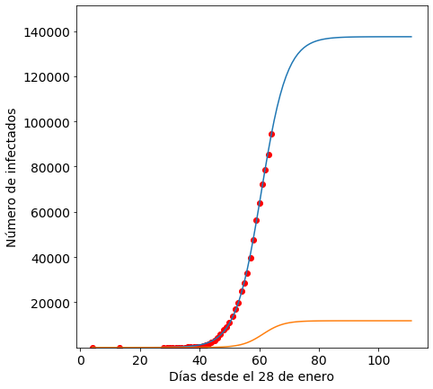
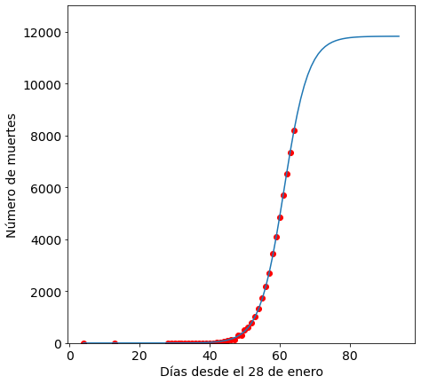

## ¿Cuándo alcanzará España el pico de contagios por covid19?

Este es un script de python para modelizar la curva de contagios de covid19 en Argentina. 


```python
import pandas as pd
import numpy as np
from datetime import datetime,timedelta
import time
from sklearn.metrics import mean_squared_error
from scipy.optimize import curve_fit
from scipy.optimize import fsolve
import matplotlib.pyplot as plt
%matplotlib inline
```


```python
url = "https://www.ecdc.europa.eu/sites/default/files/documents/COVID-19-geographic-disbtribution-worldwide.xlsx"
df = pd.read_excel(url)
```


```python
for col in df.columns: 
    print(col) 
```

    dateRep
    day
    month
    year
    cases
    deaths
    countriesAndTerritories
    geoId
    countryterritoryCode
    popData2018


```python
df['countriesAndTerritories']=='Spain'
```


    0       False
    1       False
    2       False
    3       False
    4       False
            ...  
    8097    False
    8098    False
    8099    False
    8100    False
    8101    False
    Name: countriesAndTerritories, Length: 8102, dtype: bool


```python
Spain=df[df.countriesAndTerritories=='Spain']
```


```python
Spain.head()
```


<div>
<style scoped>
    .dataframe tbody tr th:only-of-type {
        vertical-align: middle;
    }

    .dataframe tbody tr th {
        vertical-align: top;
    }

    .dataframe thead th {
        text-align: right;
    }
</style>
<table border="1" class="dataframe">
  <thead>
    <tr style="text-align: right;">
      <th></th>
      <th>dateRep</th>
      <th>day</th>
      <th>month</th>
      <th>year</th>
      <th>cases</th>
      <th>deaths</th>
      <th>countriesAndTerritories</th>
      <th>geoId</th>
      <th>countryterritoryCode</th>
      <th>popData2018</th>
    </tr>
  </thead>
  <tbody>
    <tr>
      <td>6924</td>
      <td>2020-04-01</td>
      <td>1</td>
      <td>4</td>
      <td>2020</td>
      <td>9222</td>
      <td>849</td>
      <td>Spain</td>
      <td>ES</td>
      <td>ESP</td>
      <td>46723749.0</td>
    </tr>
    <tr>
      <td>6925</td>
      <td>2020-03-31</td>
      <td>31</td>
      <td>3</td>
      <td>2020</td>
      <td>6398</td>
      <td>812</td>
      <td>Spain</td>
      <td>ES</td>
      <td>ESP</td>
      <td>46723749.0</td>
    </tr>
    <tr>
      <td>6926</td>
      <td>2020-03-30</td>
      <td>30</td>
      <td>3</td>
      <td>2020</td>
      <td>6549</td>
      <td>838</td>
      <td>Spain</td>
      <td>ES</td>
      <td>ESP</td>
      <td>46723749.0</td>
    </tr>
    <tr>
      <td>6927</td>
      <td>2020-03-29</td>
      <td>29</td>
      <td>3</td>
      <td>2020</td>
      <td>8189</td>
      <td>832</td>
      <td>Spain</td>
      <td>ES</td>
      <td>ESP</td>
      <td>46723749.0</td>
    </tr>
    <tr>
      <td>6928</td>
      <td>2020-03-28</td>
      <td>28</td>
      <td>3</td>
      <td>2020</td>
      <td>7871</td>
      <td>769</td>
      <td>Spain</td>
      <td>ES</td>
      <td>ESP</td>
      <td>46723749.0</td>
    </tr>
  </tbody>
</table>
</div>


## Preparemos los datos


```python
df1 = Spain.loc[:,['dateRep','cases','deaths']]
Format = '%Y-%m-%d %H:%M:%S'
date = pd.to_datetime(df1["dateRep"])
date=date.to_list()
```


```python
type(df1)
```


    pandas.core.frame.DataFrame


```python
dates=np.array([])
for i in date:
    t=(datetime.strptime(str(i),Format) - datetime.strptime("2020-01-28 00:00:00",Format)).days
    dates = np.append(dates, t)
```


```python
df1['dateRep']=dates
```


```python
df1=df1[df1['cases']>0]
```


```python
df1.shape
```


    (39, 3)


```python
df1.head()
```


<div>
<style scoped>
    .dataframe tbody tr th:only-of-type {
        vertical-align: middle;
    }

    .dataframe tbody tr th {
        vertical-align: top;
    }

    .dataframe thead th {
        text-align: right;
    }
</style>
<table border="1" class="dataframe">
  <thead>
    <tr style="text-align: right;">
      <th></th>
      <th>dateRep</th>
      <th>cases</th>
      <th>deaths</th>
    </tr>
  </thead>
  <tbody>
    <tr>
      <td>6924</td>
      <td>64.0</td>
      <td>9222</td>
      <td>849</td>
    </tr>
    <tr>
      <td>6925</td>
      <td>63.0</td>
      <td>6398</td>
      <td>812</td>
    </tr>
    <tr>
      <td>6926</td>
      <td>62.0</td>
      <td>6549</td>
      <td>838</td>
    </tr>
    <tr>
      <td>6927</td>
      <td>61.0</td>
      <td>8189</td>
      <td>832</td>
    </tr>
    <tr>
      <td>6928</td>
      <td>60.0</td>
      <td>7871</td>
      <td>769</td>
    </tr>
  </tbody>
</table>
</div>


## Ahora estamos listos para el modelo logístico 

La función logística es 

 $f(x,a,b,c)=\frac{c}{1+e^{\frac{-(x-b)}{a}}}$ 

Dónde $a$ es la velocidad de la infección, $b$ es el día con máximo número de infectados y $c$ es el número total de infectados al final de la epidemia 


```python
def logistic_model(x,a,b,c):
    return c/(1+np.exp(-(x-b)/a))
```


```python
type(list(df1.iloc[:,1]))
```


    list


```python
x=list(df1['dateRep'])
y=list(df1['cases'])
yd=list(df1['deaths'])
```


```python
x=np.flip(x)
y=np.flip(y)
yd=np.flip(yd)
```


```python
cum=y
cumd=yd
for i in range(1,len(y)):
    cum[i]=cum[i-1]+y[i]
    cumd[i]=cumd[i-1]+yd[i]
```


```python
fit = curve_fit(logistic_model,x,cum,p0=[2,20,4700000])
fitd= curve_fit(logistic_model,x,cumd,p0=[2,20,4700000])
```


```python
fit[1][2,2]
```


    12108832.235921424


```python
b=fit[0][1]
b 
#el dia 60 se esperarían el máximo número de infectados
```


    60.69597827723988


```python
a=fit[0][0]
c=fit[0][2]
c
```


    137474.76961857404


maximo numero de infectados que podria haber en españa varía entre 140 mil y 13 millones! 


```python
c+fit[1][2,2]
```


    12246307.005539998


```python
#1entre el 3 y el 30 por ciento de la población (y sólo hablamos de casos reportados ) 
```


```python
sol = int(fsolve(lambda x : logistic_model(x,a,b,c) - int(c),b))

```


```python
sol #final de la infección? 
```


    112


```python
ad=fitd[0][0]
bd=fitd[0][1]
cd=fitd[0][2]
cd
```


    11825.590882019538


```python
cd+fitd[1][2,2]
#podemos esperar entre 12 y 34 mil muertes aprox
```


    33797.85777091313


```python
end=(datetime.strptime("2020-01-28 00:00:00",Format) + timedelta(days=112))
end
#el 19 de mayo... mmm
```


    datetime.datetime(2020, 5, 19, 0, 0)


```python
x=x.astype(int)
x=list(x)

```


```python
pred_x = list(range(max(x),sol))
plt.rcParams['figure.figsize'] = [7, 7]
plt.rc('font', size=14)
# Real data
plt.scatter(x,cum[0:],label="Real data",color="red")
# Predicted logistic curve
plt.plot(list(x)+pred_x, [logistic_model(i,fit[0][0],fit[0][1],fit[0][2]) for i in list(x)+pred_x], label="Logistic model" )
plt.xlabel("Días desde el 28 de enero")
plt.ylabel("Número de infectados")
plt.ylim((min(cum)*0.9,c*1.1))
plt.plot(list(x)+pred_x, [logistic_model(i,fitd[0][0],fitd[0][1],fitd[0][2]) for i in list(x)+pred_x], label="Logistic model" )
plt.xlabel("Días desde el 28 de enero")
plt.ylabel("Número de infectados")
plt.ylim((min(cum)*0.9,c*1.1))
plt.show()
```





```python
[logistic_model(i,fit[0][0],fit[0][1],fit[0][2]) for i in list([65,66,67,68,69])]
```


    [100394.41195263881,
     106318.77169093365,
     111541.09968779996,
     116064.34737227163,
     119922.81263628758]


# ¿qué pasa con las muertes? 


```python
x=list(df1['dateRep'])
y=list(df1['deaths'])
```


```python
x=np.flip(x)
y=np.flip(y)
```


```python
y
```


    array([  0,   0,   0,   0,   0,   0,   0,   0,   0,   0,   0,   1,   2,
             2,   0,   0,  23,   7,  12,  37,  37,  15, 152,  21, 182, 107,
           169, 235, 324, 394, 462, 514, 738, 655, 769, 832, 838, 812, 849])


```python
cum=y
for i in range(1,len(y)):
    cum[i]=cum[i-1]+y[i]
```


```python
fit = curve_fit(logistic_model,x,cum,p0=[2,20,4700000])
```


```python
a=fit[0][0]
b=fit[0][1]
c=fit[0][2]

```


```python
c
```


    11825.590882019538


```python
#12000 muertes 
```


```python
c+fit[1][2,2]
```


    33797.85777091313


```python
#españa podria tener entre 12 y 34 mil muertes por el virus 
```


```python
sol = int(fsolve(lambda x : logistic_model(x,a,b,c) - int(c),b))

```


```python
sol
```


    95


```python
end=(datetime.strptime("2020-01-28 00:00:00",Format) + timedelta(days=95))
end
```


    datetime.datetime(2020, 5, 2, 0, 0)


```python
#el fin de las muertes podría ser el dos de mayo! nnoo
```


```python
x=x.astype(int)
x=list(x)

```


```python
pred_x = list(range(max(x),sol))
plt.rcParams['figure.figsize'] = [7, 7]
plt.rc('font', size=14)
# Real data
plt.scatter(x,cum[0:],label="Real data",color="red")
# Predicted logistic curve
plt.plot(list(x)+pred_x, [logistic_model(i,fit[0][0],fit[0][1],fit[0][2]) for i in list(x)+pred_x], label="Logistic model" )
plt.xlabel("Días desde el 28 de enero")
plt.ylabel("Número de muertes")
plt.ylim((min(cum)*0.9,c*1.1))
plt.show()
```





```python
[logistic_model(i,fit[0][0],fit[0][1],fit[0][2]) for i in list([65,66,67,68,69])]
```


    [8821.528778748227,
     9416.781232713618,
     9919.569474094338,
     10334.03410125759,
     10668.882741293177]


```python
#predigo 10334 muertes para el sabado
```


```python

```
