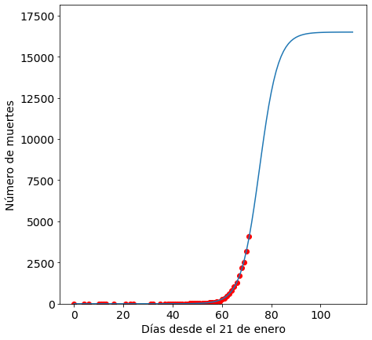

## ¿Qué pasa en USA?


Este es un script de python para modelizar la curva de contagios de covid19 en USA en base a los datos disponibles a día de hoy. Este script puede ser utilizado para modelizar los datos de cualquier país porque, como verán más abajo se lee la base de datos desde una url que tiene la información mundial de casos de covid19. 


```python
import pandas as pd
import numpy as np
from datetime import datetime,timedelta
import time
from sklearn.metrics import mean_squared_error
from scipy.optimize import curve_fit
from scipy.optimize import fsolve
import matplotlib.pyplot as plt
%matplotlib inline
import warnings
warnings.filterwarnings('ignore')
```

Lo primero que hacemos es leer los datos desde la url donde se depositan los casos diarios de covid19


```python

url = "https://www.ecdc.europa.eu/sites/default/files/documents/COVID-19-geographic-disbtribution-worldwide.xlsx"
df = pd.read_excel(url)
```


```python
df['countriesAndTerritories'][7900]
```


    'United_States_of_America'


```python
USA=df[df.countriesAndTerritories=='United_States_of_America']

```


```python
USA.tail()[1:100]

```


<div>
<style scoped>
    .dataframe tbody tr th:only-of-type {
        vertical-align: middle;
    }

    .dataframe tbody tr th {
        vertical-align: top;
    }

    .dataframe thead th {
        text-align: right;
    }
</style>
<table border="1" class="dataframe">
  <thead>
    <tr style="text-align: right;">
      <th></th>
      <th>dateRep</th>
      <th>day</th>
      <th>month</th>
      <th>year</th>
      <th>cases</th>
      <th>deaths</th>
      <th>countriesAndTerritories</th>
      <th>geoId</th>
      <th>countryterritoryCode</th>
      <th>popData2018</th>
    </tr>
  </thead>
  <tbody>
    <tr>
      <td>7922</td>
      <td>2020-01-03</td>
      <td>3</td>
      <td>1</td>
      <td>2020</td>
      <td>0</td>
      <td>0</td>
      <td>United_States_of_America</td>
      <td>US</td>
      <td>USA</td>
      <td>327167434.0</td>
    </tr>
    <tr>
      <td>7923</td>
      <td>2020-01-02</td>
      <td>2</td>
      <td>1</td>
      <td>2020</td>
      <td>0</td>
      <td>0</td>
      <td>United_States_of_America</td>
      <td>US</td>
      <td>USA</td>
      <td>327167434.0</td>
    </tr>
    <tr>
      <td>7924</td>
      <td>2020-01-01</td>
      <td>1</td>
      <td>1</td>
      <td>2020</td>
      <td>0</td>
      <td>0</td>
      <td>United_States_of_America</td>
      <td>US</td>
      <td>USA</td>
      <td>327167434.0</td>
    </tr>
    <tr>
      <td>7925</td>
      <td>2019-12-31</td>
      <td>31</td>
      <td>12</td>
      <td>2019</td>
      <td>0</td>
      <td>0</td>
      <td>United_States_of_America</td>
      <td>US</td>
      <td>USA</td>
      <td>327167434.0</td>
    </tr>
  </tbody>
</table>
</div>


## Preparemos los datos


```python
df1 = USA.loc[:,['dateRep','cases','deaths']]
#quitamos el dia de hoy que no tiene datos
#df1=df1.drop(df1.index[0])
Format = '%Y-%m-%d %H:%M:%S'
date = pd.to_datetime(df1["dateRep"])
date=date.to_list()

```


```python
type(df1)

```


    pandas.core.frame.DataFrame


```python
dates=np.array([])
for i in date:
    t=(datetime.strptime(str(i),Format) - datetime.strptime("2020-01-21 00:00:00",Format)).days
    dates = np.append(dates, t)
    
```


```python
df1['dateRep']=dates

```


```python
df1=df1[df1['cases']>0]#---> nos quedamos con las filas donde hay casos disponibles
```


```python
df1.head()

```


<div>
<style scoped>
    .dataframe tbody tr th:only-of-type {
        vertical-align: middle;
    }

    .dataframe tbody tr th {
        vertical-align: top;
    }

    .dataframe thead th {
        text-align: right;
    }
</style>
<table border="1" class="dataframe">
  <thead>
    <tr style="text-align: right;">
      <th></th>
      <th>dateRep</th>
      <th>cases</th>
      <th>deaths</th>
    </tr>
  </thead>
  <tbody>
    <tr>
      <td>7833</td>
      <td>71.0</td>
      <td>24998</td>
      <td>909</td>
    </tr>
    <tr>
      <td>7834</td>
      <td>70.0</td>
      <td>21595</td>
      <td>661</td>
    </tr>
    <tr>
      <td>7835</td>
      <td>69.0</td>
      <td>18360</td>
      <td>318</td>
    </tr>
    <tr>
      <td>7836</td>
      <td>68.0</td>
      <td>19979</td>
      <td>484</td>
    </tr>
    <tr>
      <td>7837</td>
      <td>67.0</td>
      <td>18695</td>
      <td>411</td>
    </tr>
  </tbody>
</table>
</div>


## Ahora estamos listos para el modelo logístico 

La función logística es 

 $f(x,a,b,c)=\frac{c}{1+e^{\frac{-(x-b)}{a}}}$ 

Dónde $a$ es la velocidad de la infección, $b$ es el día con máximo número de infectados y $c$ es el número total de infectados al final de la epidemia, mientras que x es el tiempo desde el comienzo de la epidemia. 


```python
def logistic_model(x,a,b,c):
    return c/(1+np.exp(-(x-b)/a))
```


```python
type(list(df1.iloc[:,1]))
```


    list


```python
x=list(df1['dateRep'])
y=list(df1['cases'])
yd=list(df1['deaths'])
```


```python
x=np.flip(x)
y=np.flip(y)
yd=np.flip(yd)
```


```python
cum=y
cumd=yd
for i in range(1,len(y)):
    cum[i]=cum[i-1]+y[i]
    cumd[i]=cumd[i-1]+yd[i]
    
    
```


```python
fit = curve_fit(logistic_model,list(x),list(cum),p0=[1,50,30000000])
fitd = curve_fit(logistic_model,list(x),list(cumd),p0=[1,50,30000000])


```


```python
a=fit[0][0]
b=fit[0][1]
c=fit[0][2]
c

```


    295091.6938952314


```python
ad=fitd[0][0]
bd=fitd[0][1]
cd=fitd[0][2]
cd

```


    16492.375541715508


```python
cd+fitd[1][2][2] 
#podria haber entre 17000 y 9 millones de muertes!
```


    9624961.783401415


```python
c+fit[1][2][2]

```


    54178268.32807386


```python
#en eeuu podría haber entre 300000 hasta 54 millones ede infectados 

```


```python
sol = int(fsolve(lambda x : logistic_model(x,a,b,c) - int(c),b))

```


```python
sol
```


    114


```python
end=(datetime.strptime("2020-01-21 00:00:00",Format) + timedelta(days=114))
end
```


    datetime.datetime(2020, 5, 14, 0, 0)


```python

#final de la infeccion mediados de mayo,,mmmm 


```


```python
x=x.astype(int)
x=list(x)


```


```python
max(x)

```


    71


```python
pred_x = list(range(max(x),sol))
plt.rcParams['figure.figsize'] = [7, 7]
plt.rc('font', size=14)
# Real data
plt.scatter(x,cum[0:],label="Real data",color="red")
# Predicted logistic curve
plt.plot(list(x)+pred_x, [logistic_model(i,fit[0][0],fit[0][1],fit[0][2]) for i in list(x)+pred_x], label="Logistic model" )
plt.xlabel("Días desde el 21 de enerp")
plt.ylabel("Número de infectados")
plt.ylim((min(cum)*0.9,c*1.1))
plt.plot(list(x)+pred_x, [logistic_model(i,fitd[0][0],fitd[0][1],fitd[0][2]) for i in list(x)+pred_x], label="Logistic model" )
plt.xlabel("Días desde el 21 de enero")
plt.ylabel("Número de muertes")
plt.show()
```


La curva naranja es la curva de la evolución de muertes y la azul es la curva de evolución de casos. 


```python
[logistic_model(i,fit[0][0],fit[0][1],fit[0][2]) for i in list([72,73,74,75,76])]
#en los proximos dias eeuu tendrá 260 mil casos 

```


    [205933.16236087526,
     222798.24195616192,
     237367.37531530412,
     249599.9251680404,
     259627.53196880565]


```python
[logistic_model(i,fitd[0][0],fitd[0][1],fitd[0][2]) for i in list([72,73,74,75,76])]
# se espera que eeuu tenga en 4 días los mismos muertos que tiene españa hoy

```


    [4871.142337582102,
     5829.17377843848,
     6864.331198787711,
     7946.325506800848,
     9038.758354710624]


```python
pred_x = list(range(max(x),sol))
plt.rcParams['figure.figsize'] = [7, 7]
plt.rc('font', size=14)
# Real data
plt.scatter(x,cumd[0:],label="Real data",color="red")
# Predicted logistic curve
plt.plot(list(x)+pred_x, [logistic_model(i,fitd[0][0],fitd[0][1],fitd[0][2]) for i in list(x)+pred_x], label="Logistic model" )
plt.xlabel("Días desde el 21 de enero")
plt.ylabel("Número de muertes")
plt.ylim((min(cumd)*0.9,cd*1.1))
plt.show()
```





 EEUU parece estar en serios problemas


```python

```
